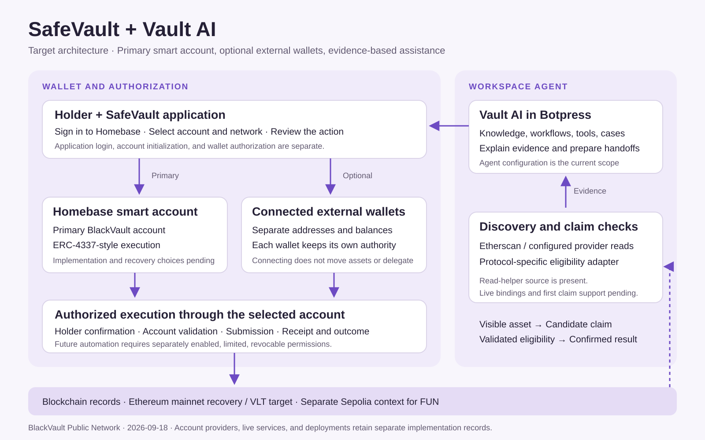

# SafeVault — Current Framework

**Updated:** 2026-09-18 · **Owner:** BlackVault Public Network · **Status:** Confirmed product direction; implementation in progress

## Account architecture

SafeVault has two wallet layers:

1. **Homebase — the primary BlackVault smart account.** A user signs in to the BlackVault application to reach their Homebase workspace, assets, activity, and account controls. The approved product direction starts with a holder-controlled smart account. Application login, account initialization, and blockchain authorization are separate operations.
2. **Connected external wallets — an optional second layer.** Existing compatible wallets retain their own addresses, networks, balances, and permissions. Connecting one enables supported visibility and interaction; moving assets into Homebase is a separately authorized transfer.

The primary design uses an ERC-4337-style account model. Optional EIP-7702 support for compatible external EOAs is a separate integration proposal. A connected wallet is not evidence of an active delegation. Account deployment timing, gas arrangements, authentication/recovery, and infrastructure providers remain implementation selections.

Assets remain recorded on their respective blockchains. Homebase brings those records into a coordinated interface; signing in does not merge accounts or transfer balances.

The existing application-policy design allows one active Homebase profile per user. Optional connected addresses remain separately identified accounts. Profile closure and replacement do not erase blockchain records. The final recovery/authentication method remains an implementation decision; the architecture does not assume a particular passkey, backup phrase, or recovery provider.

## Responsibilities

| Component | Responsibility |
| --- | --- |
| BlackVault Public Network | Ecosystem identity, application framework, and documentation |
| SafeVault | Homebase, external wallet connections, asset presentation, review, and account authorization |
| Vault AI | Workspace assistance, approved knowledge, public-data discovery, evidence explanation, and prepared handoffs |
| Discovery/claim backend | Provider requests, contract-specific eligibility checks, and structured evidence |
| Wallet execution infrastructure | Validate holder authorization, submit approved operations, and return execution evidence |

Workspace administrator permissions, VLT contract-owner powers, and individual wallet authority are separate. Signing credentials remain within the holder's chosen wallet/authentication system. Future automated execution requires separately enabled, limited, revocable permissions enforced by the actual account execution layer.

## Network roles

| Context | Network | Configuration status |
| --- | --- | --- |
| Vault Coin (VLT) | Ethereum mainnet, `1` | Production proxy and deployment receipt pending |
| FUNTOKEN (FUN) | Sepolia, `11155111` | Three recorded deployments; shared canonical address pending owner selection |
| Initial Vault AI recovery workflow | Ethereum mainnet, `1` | First supported claim contract and live connection pending validation |
| FUN discovery and development | Sepolia, `11155111` | Separate, explicitly selected testnet context |

Identify every asset by chain ID and full contract address. A token symbol alone is insufficient. Additional networks require their own supported provider and contract configuration.

## Vault AI and recovery

Botpress configures the Vault AI workspace agent: instructions, knowledge, workflows, tool bindings, and case records. SafeVault supplies the wallet interface and authorization path. Agent setup can progress while provider connections and wallet modules are still being configured.

| Finding | Required interpretation |
| --- | --- |
| Asset visible | A holding or transfer was observed at a particular address and chain. |
| Candidate claim | A contract or protocol indicator supports further investigation. |
| Validated eligibility | A supported contract adapter has checked the exact network, wallet entitlement, token, amount, recipient, required proof, relevant state, and a current simulation where applicable. |
| Confirmed recovery | Execution succeeded and the expected asset movement or protocol outcome was verified. |

A positive token balance, an ABI method name, or source-code verification alone does not establish claim eligibility. Preserve evidence sources, the queried block/time, and scan coverage. An unavailable provider or unsupported protocol produces an incomplete/unsupported result rather than a conclusion that no assets exist. Unknown values remain explicitly pending.

## Current implementation evidence

The private SafeVault source baseline reviewed for this publication is `989a312803c18aa0b0badaf88f627053a4fa86b2`. Its current application is a presentation shell with environment/chain validation and build packaging. The approved smart-account architecture is documented separately from those implemented components.

The VLT source baseline reviewed is `80e8634ac4d0f1f16b34c94a046c6f1ae4a82527`, following PR #7. Older published test totals are historical results for their recorded commits. VLT's production target is Ethereum mainnet; FUN has its own Sepolia records.

## Implementation milestones

| Milestone | Next concrete input or evidence |
| --- | --- |
| Homebase initialization | Selected account implementation/factory and deployment model |
| User authorization and recovery | Selected holder authentication and recovery design |
| Operation execution | EntryPoint, bundler, gas configuration, and tested operation lifecycle |
| External wallet connection | Supported connector and address/network/session behavior |
| VLT integration | Confirmed mainnet proxy, implementation, and deployment receipt |
| FUN integration | Owner-selected canonical Sepolia contract |
| Vault AI discovery | Configured action bindings and successful normalized data responses |
| Claim workflow | First supported protocol, wallet-specific eligibility evidence, and validated handoff |

The historical Rewards Network, cards, and Telegram Stars model remain outside this framework. Vault Coin Rewards is a distinct planned product surface.

See [Vault Coin integration](VAULT_COIN_FRAMEWORK.md) and the [ecosystem architecture](https://github.com/blackvault-opps/Blackvault-Public-Network-repo/blob/main/docs/ECOSYSTEM_ARCHITECTURE.md).

Technical references: [ERC-4337 account abstraction](https://eips.ethereum.org/EIPS/eip-4337), [EIP-7702 account code delegation](https://eips.ethereum.org/EIPS/eip-7702), and [Etherscan API documentation](https://docs.etherscan.io/introduction). These describe available standards and provider interfaces; project support is recorded in the implementation milestones above.
